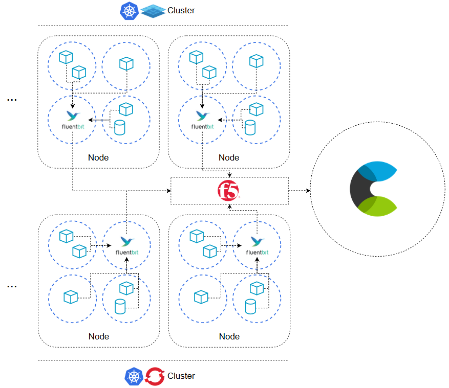
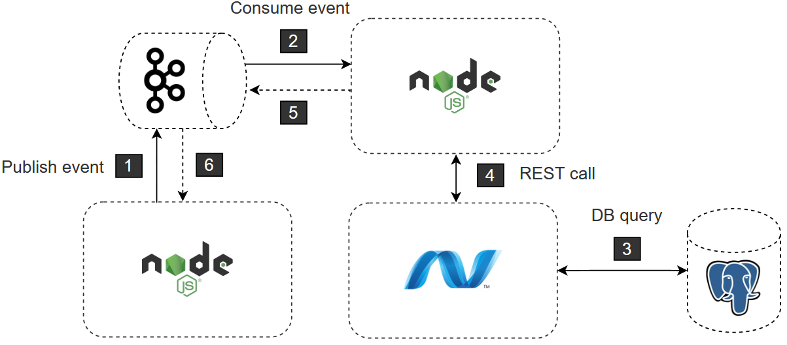

# Logging guidelines

- [Logging guidelines](#logging-guidelines)
  * [Document historiek](#document-historiek)
  * [Context](#context)
  * [Architectuur](#architectuur)
  * [Hoe moet mijn applicatie loggen [WIP]](#hoe-moet-mijn-applicatie-loggen--wip-)
  * [Wat moet mijn applicatie loggen](#wat-moet-mijn-applicatie-loggen)
    + [Technische informatie](#technische-informatie)
    + [Functionele/Business informatie](#functionele-business-informatie)
    + [Structuur](#structuur)
    + [Log levels](#log-levels)
  * [Waar moet mijn applicatie loggen](#waar-moet-mijn-applicatie-loggen)
  * [Wanneer moet mijn applicatie loggen](#wanneer-moet-mijn-applicatie-loggen)

## Document historiek

| Versie | Auteur               | Datum      | Commit                    |
| ------ | -------------------- | ---------- | ------------------------- |
| 1.0    | Quinten Scheppermans | 18/05/2020 | Release                   |
| 1.1    | Quinten Scheppermans | 08/06/2020 | Aanpassingen logstructuur |
| 1.2    | Quinten Scheppermans | 11/03/2021 | Sync ACPaaS ITD           |

## Context

Dit document bevat de richtlijnen voor het gebruik van de Logging Engine bij Digipolis Antwerpen.
Het focust enkel op de meest recente manier van loggen, die automatisch van toepassing is op elke containerized applicatie draaiende op [Openshift](https://www.openshift.com/) of [Platform 9](https://platform9.com/). De documentatie richt zich voornamelijk op developers, die custom applicaties in [NodeJS](https://nodejs.org/en/), [.NET](https://dotnet.microsoft.com/) en [Python](https://www.python.org/) ontwikkelen. Als developer vind je er een antwoord op architectuur, wat je moet loggen, waar je moet loggen en wanneer je moet loggen.

## Architectuur



Alle containers in onze **Openshift** Kubernetes clusters en via **Platform 9** opgezette Kubernetes clusters produceren logs naar **stdout**. Deze logs worden via de default Docker JSON file logging driver opgepikt door **[Fluentbit](https://fluentbit.io/)**. Fluentbit is als DaemonSet gedeployed. Dit wil zeggen dat elke fysieke node in de cluster een kopie van de Fluentbit pod runt. In de config van Fluentbit worden de logs gefilterd, geparset en dan weggeschreven via een friendly url. De **F5** vertaalt deze url in het onderliggende ECE endpoint voor de juiste omgeving.

## Hoe moet mijn applicatie loggen [WIP]

Voor 3 talen wordt er een standaard package voorzien (Nuget, NPM,...) dat eenvoudig geïnstrumenteerd kan worden of zelfs standaard in de starter-kit aanwezig is.

* [.NET](https://github.com/digipolisantwerp/generator-dgp-api-aspnetcore_yeoman/pull/28) - Changes needed
* NodeJS - Implementation ongoing
* Python - Implementation ongoing

## Wat moet mijn applicatie loggen

In zekere zin heeft elke applicatie of service de vrijheid om zelf te bepalen wat gelogd moet worden. Individuele noden maken het moeilijk een homogeen beeld te schetsen. Elke applicatie heeft een verschillend volume, verschillende privacy eisen, verschillende business eigenschappen,... Wel configureren we een aantal zaken standaard in de starter-kits, zodat correlatie tussen verschillende services eenvoudig wordt. Applicaties met afwijkende eisen kunnen de configuraties van de starter-kits dan zelf naar wens aanpassen.

### Technische informatie

Technische informatie wordt gelogd om te helpen bij het identificeren van problemen bij tracing en debugging van technische problemen. Bijvoorbeeld:

- [**Stacktraces**] Waarom produceert deze functie een NullPointerException?
- [**Availability**] Opstart of shutdown informatie van een applicatie
- [**Errors**] Een container crasht door een non-recoverable error zoals een OutOfMemoryError.
- **[Database queries]** Hoewel een database query vaak verscholen is achter een API CRUD call of getriggerd wordt door een event kan loggen toch helpen bij het onderzoeken van meer low-level problemen. Zoals de vertaling van abstracte interface naar SQL statement.
- [**Debug**] Een developer draait een applicatie in debug mode en produceert zeer fine-grained informatie over de veranderende staat van de applicatie.

Er is een veel hogere nood aan verbositeit, de structuur is moeilijker om vast te leggen en de levensduur is eerder kort. Denk in dagen, maximum weken. Bepaalde zaken zijn ook niet wenselijk in productie (bijvoorbeeld debug informatie).

### Functionele/Business informatie

Functionele informatie wordt gelogd om de lopende acties/transacties/events binnen een applicatie te registreren. Ze geven een historisch hertraceerbaar beeld op de evolutie van de staat van een applicatie. Een applicatie kan bestaan uit meerdere componenten die met elkaar communiceren over het netwerk.

Functionele logs zijn nuttig bij het debuggen van functionele problemen, analyse, audit trails, customer support, security... 

- **[API-calls]** HTTP REST/SOAP API calls vertellen veel over de flow van informatie doorheen het systeem en kunnen gebruikt worden om een goed beeld te krijgen op het gebruik van applicaties (*analyse*). Bijvoorbeeld, op basis van de historiek kunnen er terugkerende periodes van hoog en lage belasting vastgesteld worden. Het geeft ook zichtbaarheid op vlak van *security*. Een hoog aantal 403s? Ook voor *auditing* biedt dit soort logs mogelijkheden. Denk aan “Customer X heeft Service Y Z-maal geraadpleegd”. Een gelogde API request/response biedt ook uitsluitsel bij discussies over communicatie tussen 2 applicaties, aangezien er exact getoond kan worden wat er binnen en buiten is gegaan (*debuggen van functionele problemen*). Customer support ten slotte spreekt voor zich. “Waarom worden mijn facturen niet getoond op de web interface?”
- **[Asynchrone Messaging Events]** Business flows verspreiden zich (mede dankzij microservices) steeds vaker over meerdere applicaties. Om broosheid van het geheel te vermijden (wat als 1 schakel in de ketting ontbreekt?) wordt er vaak gekozen om deze flows asynchroon te maken. Vooral in gechoreografeerde maar ook in georchestreerde flows leidt dit tot zeer slechte observeerbaarheid van het geheel. Hoe weet de initiator van de flow of het geheel succesvol is afgerond? Logging is hierbij van enorm belang.
- **[Expliciete logging]** Denk aan het applicatief triggeren van logs. Batch verwerking, zware functies,...

### Structuur

Structuur verschilt per onderdeel, maar bevat enkele gemeenschappelijke elementen. Elke log is een valid **JSON** object.

> Uitbreidingen op de basisstructuur voor **[api-calls](structure/api-call.md), [events](structure/event.md)** en **[technische logs](structure/technical.md)**.

<u>*Basisstructuur*</u>

```json
{
    "timestamp": "2020-05-29T08:09:34.539Z",
    "type": ["application", "technical", "privacy"],
    "correlationId": "d80db7ea-fe4c-4df5-afe1-1b675e19921f",
    "level": "DEBUG/INFO/WARN/ERROR/FATAL/TRACE"
}
```

* *Timestamp* ([RFC3339](https://tools.ietf.org/html/rfc3339)) in overeenstemming met [de Digipolis requirements](https://github.com/digipolisantwerpdocumentation/api-requirements#datums-en-timestamps) en [het standaard Elasticsearch format](https://www.elastic.co/blog/considerations-for-timestamps-in-centralized-logging-platforms). De timestamp moet meegestuurd worden vanuit de applicatie uit nauwkeurigheidsoverwegingen. De logging stack kan latency introduceren.
* *Type* wordt meegegeven bij elk soort log om later in de pipeline eventuele splitsingen te kunnen maken op index en in geval van privacy logs personendata te verwijderen. Type is een array, meerdere opties zijn mogelijk.
* *Het correlation object* wordt meegegeven om transacties over de verschillende services heen te correleren. Formaat en inhoud van het correlation object zoals [voor Digipolis gedefinieerd](https://github.com/digipolisantwerpdocumentation/api-design-and-patterns/blob/master/patterns/correlation.md). Als output voor logs is enkel het correlationId uit het correlation object voldoende.
* log *level*s worden meegegeven om eenvoudig te kunnen filteren en prioriteren (bijvoorbeeld alerts).

### Log levels

De standaard geaccepteerde log levels over de general-purpose languages heen zijn DEBUG, INFO, WARN, ERROR, FATAL en TRACE. **Het is niet de bedoeling als developer zelf per log een log level te bepalen**. In het overgrote merendeel van de gevallen zal elke general-purpose language dit standaard juist invullen.

<u>DEBUG</u>

In alle programmeertalen kan het debug niveau aangezet worden om **meer detail** te verkrijgen over gebeurtenissen in het systeem bij het zoeken naar problemen. Het debug niveau mag standaard niet aanstaan, omdat het volume te hoog is.

<u>INFO</u>

De meeste logs zullen geproduceerd worden op het info niveau. Ze geven blijk van een **state change** binnen de applicatie. [Voorbeelden te vinden onder functionele/business informatie](#functionelebusiness-informatie).

<u>WARN</u>

Het warn niveau kan gebruikt worden om fouten te loggen die **geen impact op de gebruiker** hebben. Bijvoorbeeld, een aantal automatische retries zijn nodig om connectie te krijgen op een API call.

<u>ERROR</u>

Logs op error niveau worden aangemaakt voor herstelbare fouten die de applicatie **niet** doen crashen, maar **wel impact** hebben op de gebruiker. Bijvoorbeeld NullpointerExceptions.

<u>FATAL</u>

Logs op fatal niveau worden geproduceerd wanneer applicaties crashen door **niet-herstelbare fouten**. Bijvoorbeeld een OutOfMemoryError.

<u>TRACE</u>

Het trace niveau kan gebruikt worden wanneer er **tijdelijk nog meer detail** gewenst is dan debug kan bieden. Bijvoorbeeld bij het zoeken naar hardnekkige problemen kan een developer zelf logs injecteren op trace niveau, aan de start en het einde van methodes.

## Waar moet mijn applicatie loggen

Applicaties loggen naar **stdout**. Hier eindigt de verantwoordelijkheid van de applicatie en start de verantwoordelijkheid van de logging engine.

## Wanneer moet mijn applicatie loggen

De strategie voor wanneer een applicatie logs moet produceren is eenvoudig: **zo snel mogelijk**. Concreet betekent dit dat een gebeurtenis in het systeem gelogd moet worden zodra ze geïnitieerd is. Er hoeft niet eerst gewacht te worden tot de gebeurtenis voltrokken is. In een sterk gedistribueerd systeem is het perfect mogelijk dat één gebeurtenis een hele keten aan nieuwe gebeurtenissen ontketent voor een antwoord geformuleerd kan worden.

**Als uitzondering op deze regel** noemen we de API call. Het lijkt meer intuïtief om request en response in één log te verzamelen en bovendien verlaagt dit de load op het systeem.

Een **fictief** voorbeeld ter illustratie:



Een NodeJS service publisht een event op een Kafka topic [1]. De service **logt** dit naar stdout geformatteerd in JSON inclusief [correlation](https://github.com/digipolisantwerpdocumentation/api-design-and-patterns/blob/master/patterns/correlation.md), timestamp en andere metadata. Een 2e NodeJS service, gesubscribed op hetzelfde topic, consumeert het event [2] en **logt** dit onmiddelijk. Achterliggend triggert dit nieuwe acties. De 2e NodeJS service kopieert het correlation object en stuurt dit mee in een synchrone REST API call. Stilzwijgend wordt dit object ook in alle hieropvolgende stappen doorgestuurd. Het versturen van de call wordt nog niet **gelogd**, eerst wordt er gewacht op de response [4]. Als vorm van erkenning dat het request correct ontvangen zonder vervorming of blockage (bijvoorbeeld door netwerk, ESB, gateway, loadbalancer,...) **logt** de .NET core service het binnenkomende request. De .NET core service **logt** vervolgens het uitvoeren en resultaat van een SQL statement op een PostgresQL database [3]. De NodeJS service publisht een event op een topic verschillend van het eerste [5], deze actie wordt **gelogd**. De NodeJS service waarbij de transactie begon ten slotte, consumeert het event [6] en **logt** een laatste keer.

Het resultaat voor deze transactie is totale observeerbaarheid in de vorm van **6** logs, die een makkelijk herafspeelbare historiek van gebeurtenissen in het systeem weergeven.

