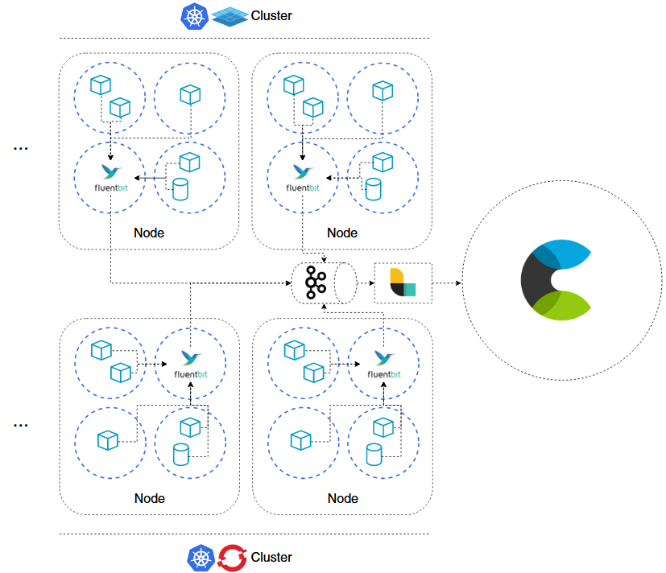

# Logging guidelines

- [Logging guidelines](#logging-guidelines)
  * [Document historiek](#document-historiek)
  * [Context](#context)
  * [Architectuur](#architectuur)
  * [Hoe moet mijn applicatie loggen [WIP]](#hoe-moet-mijn-applicatie-loggen--wip-)
  * [Wat moet mijn applicatie loggen](#wat-moet-mijn-applicatie-loggen)
  * [Waar moet mijn applicatie loggen](#waar-moet-mijn-applicatie-loggen)
  * [Wanneer moet mijn applicatie loggen](#wanneer-moet-mijn-applicatie-loggen)

## Document historiek

| Versie | Auteur               | Datum      | Commit  |
| ------ | -------------------- | ---------- | ------- |
| 1.0    | Quinten Scheppermans | 18/05/2020 | Release |
| -      | -                    | -          | -       |

## Context

Dit document bevat de richtlijnen voor het gebruik van de Logging Engine bij Digipolis Antwerpen.
Het focust enkel op de meest recente manier van loggen, die automatisch van toepassing is op elke containerized applicatie draaiende op [Openshift](https://www.openshift.com/) of [Platform 9](https://platform9.com/). De documentatie richt zich voornamelijk op developers, die custom applicaties in [NodeJS](https://nodejs.org/en/) en [.NET](https://dotnet.microsoft.com/) ontwikkelen. Als developer vind je er een antwoord op Architectuur je moet loggen, wat je moet loggen, waar je moet loggen en wanneer je moet loggen.

## Architectuur

Alle containers in onze **Openshift** Kubernetes clusters en via **Platform 9** opgezette Kubernetes clusters (MyACPAAS) produceren logs naar **stdout**. Deze logs worden via de default Docker JSON file logging driver opgepikt door **[Fluentbit](https://fluentbit.io/)**. Fluentbit is als DaemonSet gedeployed. Dit wil zeggen dat elke fysieke node in de cluster een kopie van de Fluentbit pod runt. In de config van Fluentbit worden de logs gefilterd, geparset en dan weggeschreven via een friendly url. De **F5** vertaalt deze url in het onderliggende ECE endpoint voor de juiste omgeving.

## Hoe moet mijn applicatie loggen [WIP]

## Wat moet mijn applicatie loggen

## Waar moet mijn applicatie loggen

Applicaties loggen naar **stdout**. Hier eindigt de verantwoordelijkheid van de applicatie en start de verantwoordelijkheid van de logging engine.

## Wanneer moet mijn applicatie loggen

De strategie voor wanneer een applicatie logs moet produceren is eenvoudig: **zo snel mogelijk**. Concreet betekent dit dat een gebeurtenis in het systeem gelogd moet worden zodra ze geïnitieerd is. Er hoeft niet eerst gewacht te worden tot de gebeurtenis voltrokken is. In een sterk gedistribueerd systeem is het perfect mogelijk dat één gebeurtenis, bijvoorbeeld een API call, een hele keten aan nieuwe gebeurtenissen ontketent voor een antwoord geformuleerd kan worden. Een **fictief** voorbeeld ter illustratie:

Een NodeJS service publisht een event op een Kafka topic [1]. De service **logt** dit naar stdout geformatteerd in JSON inclusief [correlation](https://github.com/digipolisantwerpdocumentation/api-design-and-patterns/blob/master/patterns/correlation.md), timestap en andere metadata. Een 2e NodeJS service, gesubscribed op hetzelfde topic consumeert het event [2] en **logt** dit onmiddelijk. Achterliggend triggert dit nieuwe acties. De 2e NodeJS service kopieert het correlation object en stuurt dit mee in een synchrone REST API call [3]. Stilzwijgend wordt dit object ook in alle hieropvolgende stappen do Het versturen van de call wordt **gelogd**. Als vorm van erkenning dat het request correct ontvangen zonder vervorming of blockage (bijvoorbeeld door netwerk, ESB, gateway, loadbalancer,...) **logt** de .NET core service het binnenkomende request. De .NET core service **logt** vervolgens het uitvoeren van een SQL statement op een PostgresQL database [4] en **logt** ook het resultaat van de query [5]. De response [6] wordt **gelogd** bij het versturen vanuit de .NET core service en wordt ook **gelogd** bij het ontvangen door de NodeJS service. De NodeJS service publisht een event op een topic verschillend van het eerste [7], deze actie wordt **gelogd**. De NodeJS service waarbij de transactie begon ten slotte, consumeert het event [8] en **logt** een laatste keer.

Het resultaat voor deze transactie is totale observeerbaarheid in de vorm van ***10*** logs, die een makkelijk herafspeelbare historiek van gebeurtenissen in het systeem weergeven.

