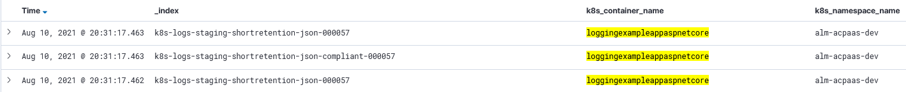
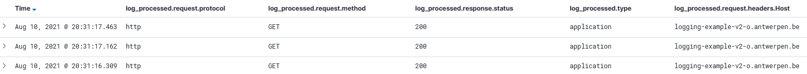

# Kibana

Je applicatie logs voldoen aan de [standaarden](../README.md) en worden [correct gevalideerd](../schema/README.md) in de juiste index afgeleverd, en nu?

## Het log object in Kibana

Niet enkel stdout van de applicatie stroomt door tot in Elasticsearch (en dus Kibana).
Ook Kubernetes en Elasticsearch zelf voegen extra metadata toe aan het JSON log object.

De meeste standaard **Elasticsearch** velden worden aangegeven met een underscore (_).
Denk aan *__index,* *__id*, *__score*, *__type*,...

De **Kubernetes metadata** krijgt een k8s prefix.
Denk aan *k8s_cluster*, *k8s_container_name*, *k8s_labels*, *k8s_namespace_name*, *k8s_pod_name*.

Aangezien deze velden steeds dezelfde structuur hebben in het JSON object, kan Elasticsearch deze velden parsen. Dit maakt slimme filtering, sortering en querying mogelijk. Hierin schuilt de kracht van standaardisering.

## De log property in het log object

**Zonder standaardisering** eindigen de mogelijkheden daar. De eigenlijke log van de applicatie, genomen uit stdout, kan enkel geïnterpreteerd worden als string. Het is enigszins mogelijk om deze strings toch te queryen met **wildcards** (*****). Maar:

* Dit is enorm inefficient in Elasticsearch, bijna onmogelijk met onze volumes.
* Je weet niet wat je in deze strings kan verwachten, dus wordt het moeilijk om te vinden.
* Gevoelige informatie krijgt een kans om ongezien in de logs te sluipen.

**Met applicatielog standaarden** kan er plots veel meer:

* Je kan filteren op status codes (hoeveel procent van onze calls falen)
* Je kan statistieken en dashboards trekken over de meest en minst gebruikte endpoints.
* ...

