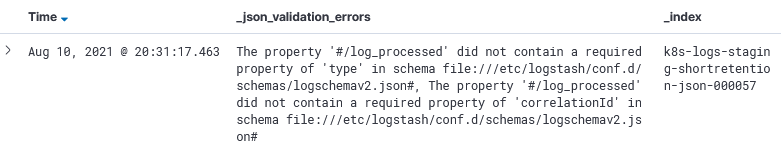

# Log schema validatie

Door beperkingen in Elasticsearch is het noodzakelijk dat alle log properties tot een **minimale mapping** behoren. 
Een deel van die mapping wordt reeds ingepalmd door metadata die Kubernetes aan het 'logobject' toevoegt. Lees meer over die parent structuur [hier](../kibana/README.md).
Logs die niet voldoen aan het schema in deze folder `logschema.json` zullen door de pipeline naar een andere **index** gestuurd worden.
Eén schema omvat alle mogelijke properties van de 3 mogelijke soorten logs:

* API call
* Event
* Technisch

## Indices

Uit onderstaande decision table kan afgeleid worden naar welke index een bepaalde log wordt gestuurd.
De uitkomst heeft **geen impact** op de gebruikerservaring. 
In Kibana kan perfect op verschillende indices heen gezocht worden zolang deze onder hetzelfde index pattern behoren. Dit is altijd het geval.

Vooralsnog heeft de uitkomst ook **geen impact** op de retentie van de log.
In de toekomst zal dit hopelijk veranderen. Het volume van de huidige situatie maakt het onmogelijk om logs een ruime tijd bij te houden,
maar vanzelfsprekend zou dit een voordeel zijn voor auditing, debugging, statistieken,...

Aangezien enkel expliciet gewilde applicatie logs in een veel lager volume tot in de meest restrictieve indices zullen doorstromen, is daar wel een mogelijkheid om de retentieperiode aanzienlijk te verhogen.

| Valid JSON? | Valid Schema? | Index                                                  | Index pattern |
| ----------- | ------------- | ------------------------------------------------------ | ------------- |
| Nee         | Nee           | k8s-logs-xxx-shortretention-xxx                        | k8s-logs-*    |
| Ja          | Nee           | k8s-logs-xxx-shortretention-**json**-xxx               | k8s-logs-*    |
| Ja          | Ja            | k8s-logs-xxx-shortretention-**json**-**compliant**-xxx | k8s-logs-*    |

Indien een log wel als valid JSON geparsed kan worden, maar niet aan het schema voldoet, wordt er in Kibana een property *_json_validation_errors* toegevoegd.




## Lokaal Output valideren

Om te **testen** of de stdout output van een applicatie voldoet aan de eisen opgelegd in `logschema.json` kan het schema gedownload worden en in combinatie met jsonschema en één of meerdere voorbeeldfiles kan het script uitgevoerd worden.

### jsonschema installeren

```bash
pip install jsonschema
```

### jsonschema uitvoeren

```bash
jsonschema -i example.json logschema.json
```

